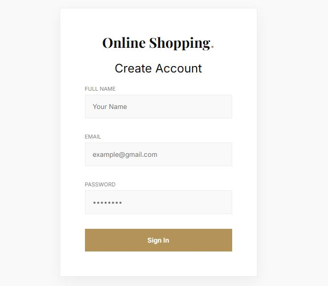
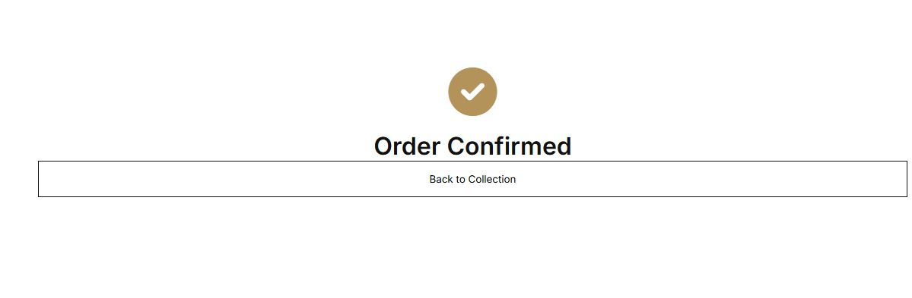
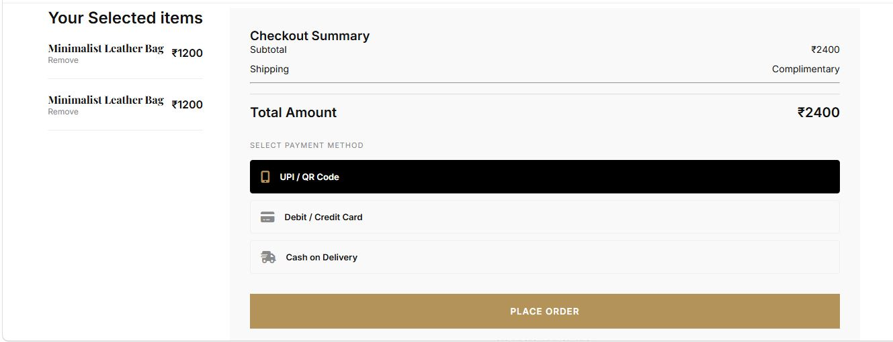

Online Shopping Web Application

A responsive and user-friendly Online Shopping Web Application developed using HTML, CSS, and JavaScript.  
This project provides an interactive shopping experience with product listings, shopping cart functionality, and responsive design for different devices.

## 🚀 Features

- 🛍️ Product Listing Page
- 🔍 Search and Filter Products
- 🛒 Add to Cart Functionality
- ➕ Increase/Decrease Product Quantity
- 💰 Price Calculation
- 👤 User-Friendly Interface
- ⚡ Fast and Interactive Frontend

---

## 🛠️ Technologies Used

- HTML
- CSS
- JavaScript

---

## 📸 Screenshots

### Home Page

### Login Page

### Order Confirmation Page

### Payment Section Page

### Product Details Page

### Confirmation Messages Page

## 📂 Project Structure

online-shopping-app/
│
├── index.html
├── style.css
├── script.js
├── images/
└── README.md

## ▶️ How to Run the Project

1. Download the repository
2. Open the project folder
3. Double click on `index.html`

## 👩‍💻 Author

Bhavana Lakshmi
git clone https://github.com/ChunduriBhavanaLakshmi/online-shopping-app.git
